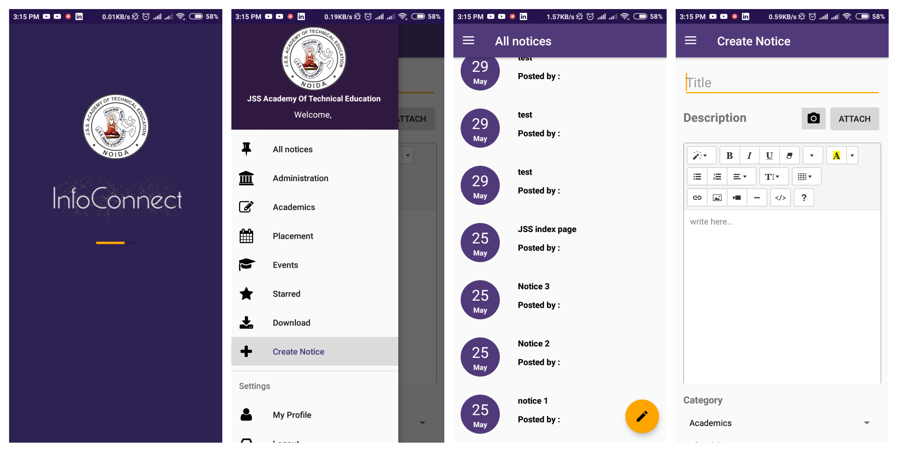

Infoconnect Android App
===================================

This is an android app for the information portal of
JSS Acaddemy of Technical Education, Noida.
The web portal is live on: http://210.212.85.155

Introduction
------------

## Installation

Clone this repository and import into **Android Studio**
```bash
git clone https://github.com/ncs-jss/click.git
```

## Pre-requisites

- Android SDK 28
- Android Build Tools v28.0.3
- Androidx Repository


## Generating APK
From Android Studio:
1. ***Build*** menu
2. ***Generate APK...***


## Maintainers
This project is mantained by:
* [Yasha Singh](http://github.com/yashasingh)
* [Shobhit Agarwal](http://github.com/shobhit1997)


## Contributing

1. Fork it
2. Create your feature branch (git checkout -b my-new-feature)
3. Commit your changes (git commit -m 'Add some feature')
4. Push your branch (git push origin my-new-feature)
5. Create a new Pull Request


Screenshots
-------------

 